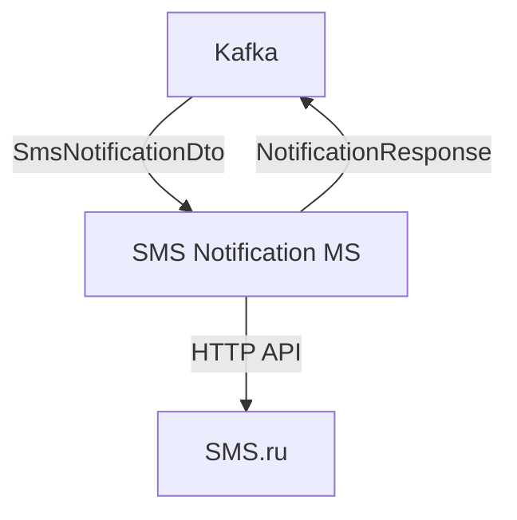
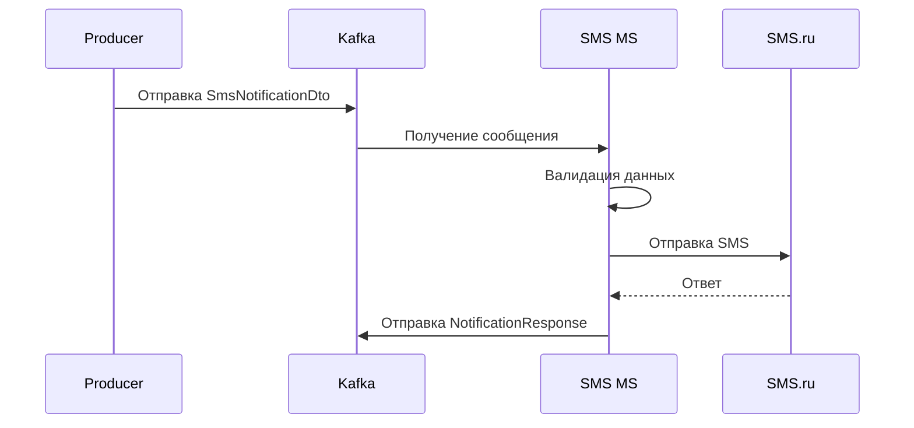

# SMS Notification Microservice

Микросервис для обработки и отправки SMS-уведомлений через API сервиса SMS.ru.  
Интегрируется с Kafka для получения задач на отправку и отправки ответов.

### Справочная информация о сервисе SMS.ru
Если используется почта @sms.ru, либо вы программист, отправляющий себе СМС сообщения из своих программ,
то вы можете воспользоваться бесплатным предложением - до 5 СМС на собственный номер в день 
при условии, что каждое сообщение помещается в 1 СМС (до 70 русских / 160 латинских символов).  
Для тестирования можно установить параметр test=1. В этом режиме SMS не отправляются, плата не взимается.  

## Описание

Микросервис предоставляет:
- Получение задач на отправку SMS из Kafka
- Валидацию данных уведомления
- Отправку SMS через API SMS.ru
- Отправку результатов обработки обратно в Kafka

## Диаграмма архитектуры


## Диаграмма последовательности  


## Конфигурация  
Настройки приложения (application.yml) 
```yaml
server:
  port: 8084

spring:
  application:
    name: sms-notification-ms
  kafka:
    bootstrap-servers: localhost:9092
    consumer:
      group-id: notification-group
      auto-offset-reset: earliest
      key-deserializer: org.apache.kafka.common.serialization.StringDeserializer
      value-deserializer: org.springframework.kafka.support.serializer.JsonDeserializer
      properties:
        spring.json.trusted.packages: "ru.globus.smsnotificationms.dto.request"
        spring.json.use.type.headers: false
        spring.json.value.default.type: ru.globus.smsnotificationms.dto.request.SmsNotificationDto
    producer:
      key-serializer: org.apache.kafka.common.serialization.StringSerializer
      value-serializer: org.springframework.kafka.support.serializer.JsonSerializer
    topic:
      sms-notifications: sms-notifications-topic
      notification-responses: notification-responses-topic
    listener:
      missing-topics-fatal: false
      ack-mode: BATCH
      type: BATCH

# https://sms.ru/sms/send?api_id=XXXXXXXX-XXXX-XXXX-XXXX-XXXXXXXXXXXX&to=7999999999&msg=hello+world&json=1&test=1
sms:
  smsProperties:
    url: "https://sms.ru"
    path: "/sms/send"
    header: "application/x-www-form-urlencoded"
    key: "XXXXXXXX-XXXX-XXXX-XXXX-XXXXXXXXXXXX" # Авторизация по уникальному ключу (api_id)
    json: "1" # json=1 - Данный параметр вызывает ответ сервера в формате JSON, в котором предоставлено больше данных об отправленных сообщениях
    test: "1" # test=1 Имитирует отправку сообщения для тестирования ваших программ на правильность обработки ответов сервера. При этом само сообщение не отправляется и баланс не расходуется.
    to: "79999999999" # Номер телефона для тестовых уведомлений
    maxLength: "70" # Максимальная длина сообщения
```

### Зависимости (build.gradle)
Основные зависимости:
* Spring Boot (OpenFeign, Kafka)
* Lombok
* Jackson
* Kafka Clients

## Форматы сообщений
Входящее сообщение (Kafka)  
```json
{
  "notificationId": "123",
  "createdAt": "2025-01-01T12:00:00",
  "sender": {
    "system": "Loan-system",
    "userId": "user-1"
  },
  "message": "Кредит одобрен",
  "phone": "79991234567"
}
```

Исходящее сообщение (Kafka)
```json
{
  "notificationId": "123",
  "channel": "SMS",
  "status": "SUCCESS",
  "errorCode": null,
  "errorMessage": null
}
```

## Обработка ошибок  
Микросервис обрабатывает:
* Ошибки валидации телефона (PhoneValidationException)
* Ошибки валидации сообщения (MessageValidationException)
* Ошибки отправки SMS (SmsException)

Все ошибки логируются и отправляются в Kafka с соответствующим статусом.  

## Тестирование
Для тестирования установите sms.smsProperties.test=1 - в этом режиме SMS не отправляются, 
но проверяется вся цепочка обработки.

